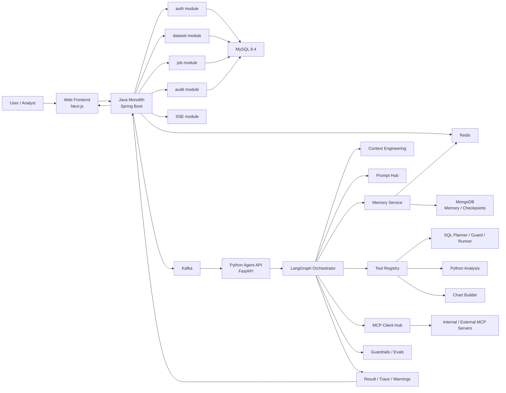
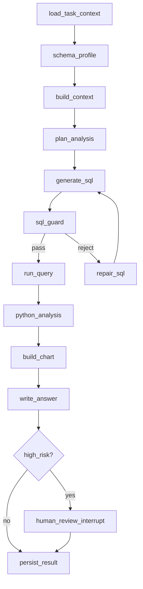

# 数据分析 Agent 项目架构设计

> 说明：本文档描述的是项目目标态架构。对于“自然语言对话 + 流式分析”的初版落地方案，请以 `docs/module-breakdown/natural-language-chat-initial-architecture.md` 和各模块子文档为准。

## 1. 项目定位

项目目标是实现一个面向 `CSV / Excel / MySQL` 数据源的企业级数据分析 Agent。系统接收自然语言问题，自动完成数据源理解、权限校验、SQL 规划、Python 分析、图表生成、结论输出，并通过人工审核、审计日志、记忆体系和 MCP 扩展能力提升稳定性与可控性。

当前推荐采用 `双后端 + Java 单体 + Python Agent Runtime` 架构：

- `Java Backend`：单体 Spring Boot 后端，负责统一 API 入口、认证鉴权、权限校验、文件与数据集管理、任务入口、SSE 推送和审计。
- `Python Agent Backend`：负责 LangGraph Agent Runtime、工具编排、记忆管理、MCP 调用、Prompt/Context Harness、评测与稳定性约束。

设计原则：

- `权限边界` 固定在 Java 端，Agent 永远运行在最小权限上下文内。
- `Agent 决策` 固定在 Python 端，业务系统不直接暴露给大模型。
- `异步任务` 通过 Kafka 解耦，避免 Java 与 Python 强耦合。
- `状态、缓存、审计` 独立存储，便于回放、风控和复盘。

## 2. 总体架构图



## 3. 核心调用链

### 3.1 在线分析流程

1. 用户在前端上传文件或选择已有数据集，并输入分析问题。
2. Java 单体后端校验登录态，并解析用户租户、角色、数据权限范围。
3. `job` 模块创建分析任务，将任务上下文写入 MySQL，并向 Kafka 投递事件。
4. Python Agent 消费任务事件，加载受限上下文后启动 LangGraph。
5. LangGraph 依次执行 `schema_inspector -> context_builder -> planner -> sql_guard -> query_runner -> python_runner -> chart_builder -> answer_writer`。
6. 关键节点执行前写入节点级 checkpoint，供异常中断后人工确认恢复。
7. 若命中高风险规则，例如跨表敏感字段、超大结果集、疑似越权字段，则进入 `human_review` 节点。
8. 任务结果、推理轨迹、工具调用记录和审计日志回写 MySQL；热点对话上下文写入 Redis 待落库队列与热上下文。
9. Memory Service 将 Redis 待落库记录幂等写入 MongoDB，MongoDB 提交成功后才清理 Redis。
10. Java 后端通过 SSE 将中间事件和最终结果推送给前端。

### 3.2 权限控制原则

- Java 端执行 `身份认证 + 角色鉴权 + 行列权限裁剪 + 数据集授权`。
- Python 端不直接做业务授权判定，只消费 Java 传入的 `最小权限上下文`。
- Agent 工具执行层再做 `SQL 白名单 / 只读限制 / 行数限制 / 超时限制`。
- 所有敏感操作必须记录 `who / when / dataset / sql / result_size / trace_id`。

## 4. 技术栈与职责

| 层 | 技术栈 | 作用 |
|---|---|---|
| 前端 | `Next.js + TypeScript + Tailwind + ECharts` | 文件上传、任务中心、图表展示、SQL 审核、Trace 查看 |
| Java 主后端 | `Java 21 + Spring Boot 3.5.16` | 单体主入口、鉴权、权限校验、任务入口、SSE 推送、审计、数据集管理 |
| 安全 | `Spring Security 7` | JWT、RBAC、租户隔离、接口鉴权 |
| Java 数据访问 | `Spring Data JPA / MyBatis-Flex` | 用户、任务、数据集、文件、审计等表访问 |
| Python Agent API | `Python 3.12 + FastAPI` | Agent 服务暴露、任务消费、状态查询、内部回调 |
| Agent 编排 | `LangGraph` | 有状态工作流、工具调用、记忆、人工中断、可恢复执行 |
| 模型调用 | `OpenAI Responses API` | 规划、工具选择、结果解释、结构化输出 |
| 文件与业务存储 | `MySQL 8.4 LTS` | 用户、租户、文件、数据集元数据、任务、审计 |
| Agent 记忆 | `Redis + MongoDB` | Redis 保存待落库队列与热上下文，MongoDB 保存长期对话与节点快照 |
| 缓存 | `Redis` | 会话缓存、Schema 缓存、任务热点状态、限流计数、待落库队列 |
| 消息队列 | `Kafka 4.3.x` | 任务投递、状态回传、审计事件、异步解耦 |
| 图表分析 | `Pandas / Polars / Matplotlib / Plotly` | 数据清洗、统计分析、图表生成 |
| SQL 执行 | `SQLAlchemy + 驱动` | 统一只读查询执行与连接管理 |
| 可观测性 | `OpenTelemetry + Prometheus + Grafana` | Trace、延迟、成本、失败率、工具调用监控 |
| Agent 稳定性 | `Pydantic + JSON Schema + 自定义 Guardrails` | 输出结构约束、工具参数校验、结果规范化 |
| MCP 集成 | `MCP Client SDK + Internal MCP Servers` | 接入数据库、文件、指标、业务知识、计算工具 |

## 5. 版本建议

- `Java`：`21 LTS`
- `Spring Boot`：`3.5.16`
- `Python`：`3.12`
- `MySQL`：`8.4 LTS`
- `MongoDB`：`8.x` 或稳定 LTS 线
- `Kafka`：`4.3.x`
- `Redis`：`8.x`

## 6. 目录设计

建议继续使用 `monorepo`，但 Java 后端改为 `单体工程 + 分模块分包`，不再拆成多个微服务子工程。

```text
agent-data-platform/
├─ docs/
│  └─ data-analysis-agent-architecture.md
├─ frontend-web/
│  ├─ app/
│  ├─ components/
│  ├─ features/
│  ├─ lib/
│  └─ package.json
├─ backend-java/
│  ├─ pom.xml
│  └─ src/
│     ├─ main/
│     │  ├─ java/com/dataagent/platform/
│     │  │  ├─ DataAgentApplication.java
│     │  │  ├─ common/
│     │  │  │  ├─ web/
│     │  │  │  ├─ security/
│     │  │  │  ├─ kafka/
│     │  │  │  ├─ mysql/
│     │  │  │  └─ observability/
│     │  │  └─ modules/
│     │  │     ├─ gateway/
│     │  │     ├─ auth/
│     │  │     ├─ dataset/
│     │  │     ├─ job/
│     │  │     └─ audit/
│     │  └─ resources/
│     └─ test/
│        └─ java/com/dataagent/platform/
├─ backend-agent/
│  ├─ pyproject.toml
│  ├─ src/agent_backend/
│  │  ├─ api/
│  │  │  ├─ http/
│  │  │  └─ kafka/
│  │  ├─ orchestration/
│  │  ├─ capabilities/
│  │  │  ├─ agent_runtime/
│  │  │  └─ data_analysis/
│  │  └─ foundation/
│  │     ├─ contracts/
│  │     └─ datasource/
│  └─ tests/
├─ runtime/logs/backend-agent/alerts/
├─ infra/
│  ├─ docker/
│  ├─ k8s/
│  ├─ mysql/
│  ├─ mongo/
│  ├─ kafka/
│  ├─ redis/
│  └─ observability/
└─ scripts/
   ├─ dev/
   ├─ ci/
   └─ seed/
```

## 7. Java 单体模块说明

### 7.1 `common/*`

职责：

- `common/web`：统一返回体、异常码、全局异常处理
- `common/security`：JWT 解析、权限模型、用户上下文
- `common/kafka`：事件模型、消息封装
- `common/mysql`：数据库公共配置
- `common/observability`：日志、链路追踪、指标上下文

原则：

- 只放基础设施能力
- 不放业务逻辑

### 7.2 `modules/gateway`

职责：

- 对前端暴露统一入口
- 聚合鉴权、任务、数据集和审计相关接口
- 承担外部 API 边界

### 7.3 `modules/auth`

职责：

- 登录、令牌、角色、租户、数据权限
- 构造传给 Python Agent 的最小权限上下文

边界：

- 不承载 Agent 编排逻辑
- 不越权访问其他业务模块的内部实现

### 7.4 `modules/dataset`

职责：

- 文件上传
- 数据集注册
- 元数据与 Schema 摘要管理
- 数据集授权关系维护

### 7.5 `modules/job`

职责：

- 创建分析任务
- 分配 `trace_id / task_id / tenant_id`
- 投递 Kafka 事件
- 接收 Python Agent 的结果回传

### 7.6 `modules/audit`

职责：

- 保存操作日志、审批日志、Agent 运行轨迹
- 保存用户确认过的 SQL、图表和结论
- 支持后续回放与审计

## 8. Python Agent 端模块说明

### 8.1 `api/http` 与 `api/kafka`

职责：

- 仅保留 HTTP 与 Kafka 入口适配
- HTTP 接收 Java 内网调用，Kafka 订阅任务消息
- 不承载 Agent 业务编排

### 8.2 `orchestration`

职责：

- 管理 LangGraph 图、状态、节点执行与事件流转
- 保存节点级快照并支持人工确认后恢复

### 8.3 `capabilities`

职责：

- `agent_runtime` 提供上下文工程、Prompt、Tool Calling、记忆服务、Guardrails、可观测性与 Evals
- `data_analysis` 是当前单 Agent 业务实现，拥有 SQL、Python、Chart 具体工具与 Prompt 模板
- 后续多 Agent 演进时在 `capabilities/<agent>/` 新增能力目录

### 8.4 `foundation`

职责：

- `contracts` 维护跨层类型契约
- `datasource` 仅封装 Redis、MongoDB、MySQL、Excel/CSV 等数据源 Adapter

## 9. Agent 内部推荐节点图



## 10. 当前阶段最值得先实现的模块

说明：当前 MVP 分支已先落地 `foundation/contracts / foundation/datasource / orchestration / agent_runtime/context / agent_runtime/memory / agent_runtime/observability` 能力。

第一阶段：

1. Java `auth`
2. Java `dataset`
3. Java `job`
4. Python `api/http + api/kafka`
5. Python `orchestration`
6. Python `capabilities/data_analysis/tools/sql`
7. Python `capabilities/data_analysis/tools/chart`
8. Python `agent_runtime/context`
9. Python `agent_runtime/prompt`
10. Python `agent_runtime/guardrails`

第二阶段：

1. Python `foundation/datasource + agent_runtime/memory`
2. Python `agent_runtime/tool_calling`
3. Python `agent_runtime/evals`
4. Java `audit` 的高级回放与审批

## 11. 版本依据与参考

- Spring Boot：[Spring Boot](https://spring.io/projects/spring-boot/), [System Requirements](https://docs.spring.io/spring-boot/system-requirements.html)
- LangGraph：[Overview](https://docs.langchain.com/oss/python/langgraph/overview), [Persistence](https://docs.langchain.com/oss/python/langgraph/persistence), [Interrupts](https://docs.langchain.com/oss/python/langgraph/interrupts), [Memory](https://docs.langchain.com/oss/python/langgraph/add-memory)
- MCP：[Intro](https://modelcontextprotocol.io/docs/2026-07-28/getting-started/intro), [Architecture](https://modelcontextprotocol.io/docs/2026-07-28/learn/architecture), [Specification](https://modelcontextprotocol.io/specification/2025-11-25)
- Kafka：[Kafka Downloads](https://kafka.apache.org/community/downloads/), [Documentation](https://kafka.apache.org/documentation/)
- MySQL：[MySQL 8.4 Release Notes](https://dev.mysql.com/doc/relnotes/mysql/8.4/en/)
- MongoDB：[MongoDB Docs](https://www.mongodb.com/docs/)
- Redis：[Redis Docs](https://redis.io/docs/latest/)
